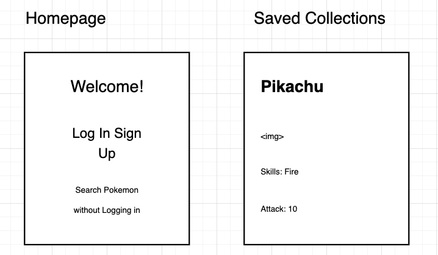

# FullStack Pokemon

## User Stories

A user story is an informal, general explanation of a software feature written from the prespective of the end user. (atlassian.com)

1. As a User, I want to be able to Search for a Pokemon
   1. EJS View - homePage (search form)
   1. Router - GET /
   1. Router - POST /search
   1. Controller - searchPokemon(req, res)
   1. EJS View - displayPokemon
2. As a User, I want to be able to Save a pokemon to my Saved Collection.
3. As a User, I want to be able to Create my own Pokemons in my Saved Collection
4. As a User, I want to be able to Update a
   Pokemon in my Saved Collection.
5. As a User, I want to be able to Read the Pokemons from my Saved Collection.
6. As a User, I want to be able to Delete a Pokemon from my Saved Collection.
7. As a User, I want to be able to Sign up for a new account
8. As a User, I want to be able to Log in to an existing account

## Requirements

1. Use Node.js & Express.js as your back end framework
2. Integrate MongoDB as your database
3. Add User Authentication
4. Use a view engine with EJS Templates as your front end application

## Wireframes

## Routes & Controllers

TODO
